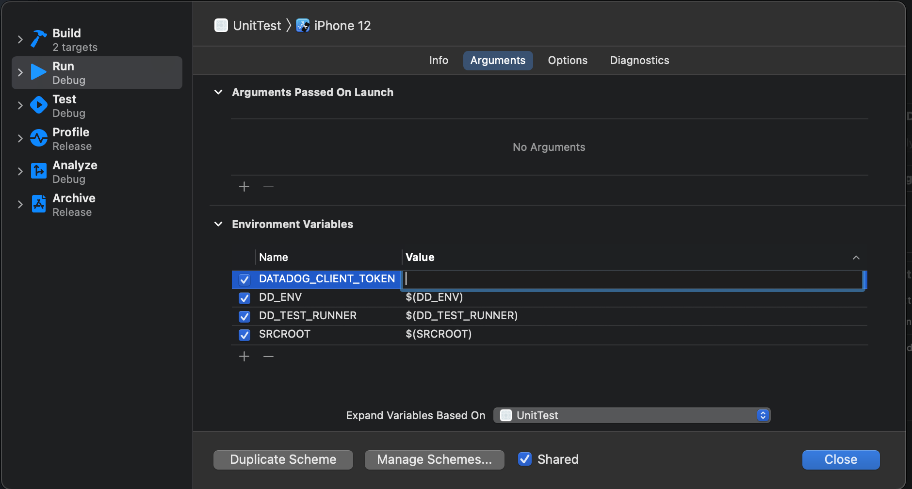

# Swift-Ci-Visibility
 
## Compatibility 
Swift >= 5.2

Objective-C >= 2.0

## Supported platforms:

iOS >= 11.0

macOS >= 10.13

tvOS >= 11.0


## Prerequisites
 [Install the Datadog Agent to collect tests data](https://docs.datadoghq.com/continuous_integration/setup_tests/agent/?tab=azurepipelines)

 <br/>

[Install the iOS SDK](https://docs.datadoghq.com/continuous_integration/setup_tests/swift/?tab=swiftpackagemanager#installing-the-swift-testing-sdk) 

Setup:
From the top bar select Product -> Scheme -> Edit Scheme

Replace Client token value with your own client token
<br/> 

<br/> 
You can get your client token from the link below:
https://app.datadoghq.com/account/settings#api 

Via terminal, cd into the directory and run the command below:
```
DD_TEST_RUNNER=1 DD_ENV=ci DD_SERVICE=my-swift-app xcodebuild \
-project UnitTest.xcodeproj \
-scheme UnitTest \
-destination platform=iOS\ Simulator,name=iPhone\ 12\ Pro \
test
```

## Results:
Should be shown in datadog ci after a couple of minutes:
https://app.datadoghq.com/ci/test-runs?index=citest&start=1632627253983&end=1632630853983&paused=false

Working example output:


## Documentation
https://docs.datadoghq.com/continuous_integration/setup_tests/swift/?tab=swiftpackagemanager#installing-the-swift-testing-sdk
